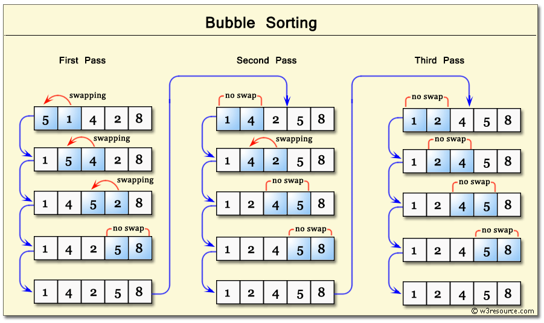
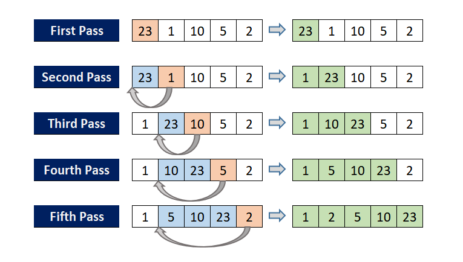
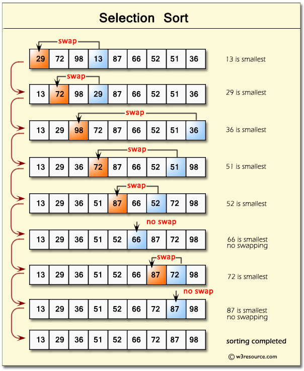

#  0x1B. C - Sorting algorithms & Big O
## Bubble Sort Algorithm (the simplest sorting algorithm)
it works by repeatedly swapping the adjacent elements if they are in the wrong order

##### complexity
- *Time Complexity: O(N2)*
- *Auxiliary Space: O(1)*

## Insertion Sort Algorithm
it works by iteratively inserting each element of an unsorted list into its correct position in a sorted portion of the list. 

##### complexity
- *Time Complexity: O(N2)*
- *Auxiliary Space: O(1)*

## Selection Sort Algorithm
selects the smallest (or largest) element from the unsorted portion of the list and swaps it with the first element of the unsorted part.

##### complexity
- *Time Complexity: O(N2)*
- *Auxiliary Space: O(1)*