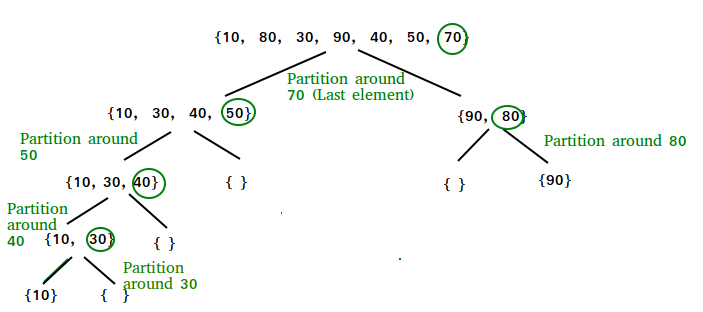
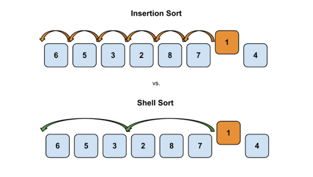

#  0x1B. C - Sorting algorithms & Big O
## Bubble Sort Algorithm (the simplest sorting algorithm)
it works by repeatedly swapping the adjacent elements if they are in the wrong order

##### complexity
- *Time Complexity: O(N2)*
- *Auxiliary Space: O(1)*

## Insertion Sort Algorithm
it works by iteratively inserting each element of an unsorted list into its correct position in a sorted portion of the list. 

##### complexity
- *Time Complexity: O(N2)*
- *Auxiliary Space: O(1)*

## Selection Sort Algorithm
selects the smallest (or largest) element from the unsorted portion of the list and swaps it with the first element of the unsorted part.

##### complexity
- *Time Complexity: O(N2)*
- *Auxiliary Space: O(1)*

## Quick Sort Algorithm
it is a sorting algorithm based on the Divide and Conquer algorithm that picks an element as a pivot and partitions the given array around the picked pivot by placing the pivot in its correct position in the sorted array.

##### complexity
- *Time Complexity: O(NlogN)*
- *Auxiliary Space: O(logN)*

## Shell Sort Algorithm
it is mainly a variation of Insertion Sort. In insertion sort, we move elements only one position ahead. When an element has to be moved far ahead, many movements are involved. The idea of ShellSort is to allow the exchange of far items. 

##### complexity
- *Time Complexity: O(N2)*
- *Auxiliary Space: O(1)*

## Cocktail Sort Algorithm
Cocktail Sort is a variation of Bubble Sort that improves efficiency by traversing an array in both directions. Instead of just moving the largest unsorted element to its correct position as in Bubble Sort, Cocktail Sort:

- Moves from left to right, pushing the largest element to the end.
- Then moves from right to left, pushing the smallest element to the beginning.
##### complexity
- *Time Complexity: O(N2)*
- *Auxiliary Space: O(1)*
